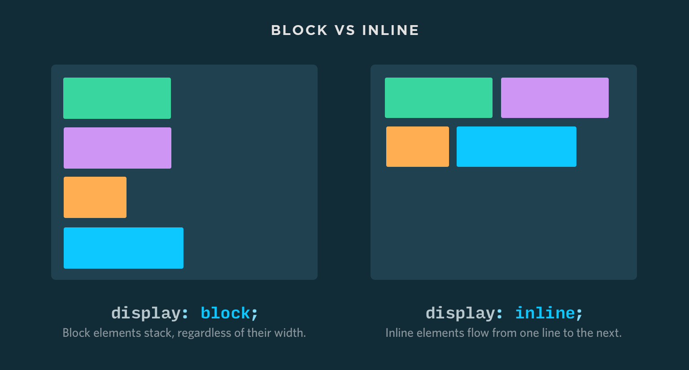

# Elementos HTML5

## Importancia y énfasis al texto

La etiqueta `<strong>` se utiliza para darle importancia al texto y la etiqueta `<em>` se utiliza hacer énfasis en el texto.

Generalmente `<strong>` se muestra en **negrilla** y `<em>` en _itálica_, pero este comportamiento se puede modificar a través de CSS.

```markup
<p>Esto es 
    <strong>muy importante</strong> y deseo 
    <em>hacer énfasis</em> en esto.
</p>
```

**Nota:** También existen las etiquetas `<b>` e `<i>` que muestran el texto en **negrilla** e _itálica_ \(cursiva\) respectivamente.

## Saltos de línea y línea horizontal

La etiqueta `<br>` se utiliza para forzar un salto de línea \(lo equivalente a oprimir la tecla `Enter` cuando estás escribiendo un documento\)

```markup
<p>Hola<br>Geeks!!</p>
```

La etiqueta `<br>` no necesita una **etiqueta de cierre**.

La etiqueta `<hr>` muestra una línea horizontal en el documento.

## Listas

Puedes crear listas ordenadas y no ordenadas.

Una **lista ordenada** está enumerada mientras que una **lista no ordenada** utiliza viñetas.

Un ejemplo de **lista ordenada** es la siguiente:

1. Elemento 1
2. Elemento 2
3. Elemento 3

Un ejemplo de **lista no ordenada** es la siguiente:

* Elemento 1
* Elemento 2
* Elemento 3

Una **lista ordenada** se crea con la etiqueta `<ol>` y los items con la etiqueta `<li>`:

```markup
<ol>
  <li>Elemento 1</li>
  <li>Elemento 2</li>
  <li>Elemento 3</li>
</ol>
```

Una **lista no ordenada** se crea con la etiqueta `<ul>` y los items con la etiqueta `<li>`:

```markup
<ul>
  <li>Elemento 1</li>
  <li>Elemento 2</li>
  <li>Elemento 3</li>
</ul>
```

**Nota:** Por ningún motivo utilices la etiqueta `<li>` por fuera de un `<ul>` o `<ol>`.

## Etiquetas invisibles

Existen dos etiquetas que no son visibles en el documento pero se utilizan para agrupar otros elementos y aplicarles estilos: `<div>` y `<span>`.

Veamos un ejemplo de `<div>` en donde estamos agrupando un título `<h1>`, una imagen `` y un párrafo `<p>`:

```markup
<div class="main-section">
  <h1>Mi portafolio Geek</h1>
  
  <p></p>
</div>
```

`<span>` se utiliza para aplicarle estilos a un texto \(generalmente dentro de un párrafo\):

```markup
<p>Hola,mi nombre es <span class="nombre">John</span></p>
```

## Elementos de bloque y en línea

Cada elemento HTML tiene un valor de `display` por defecto dependiendo del tipo de elemento del que se trate. El valor por defecto para la mayoría de los elementos es `block` o `inline`

_**Elementos Block**_

Un elemento a nivel de block siempre empieza en una línea nueva y toma el ancho completo disponible \(se estira hacia la izquierda y hacia la derecha tan lejos como pueda\).

_**Elementos Inline**_

Un elemento inline no empieza en una línea nueva y solo toma el ancho que necesite tomar.



